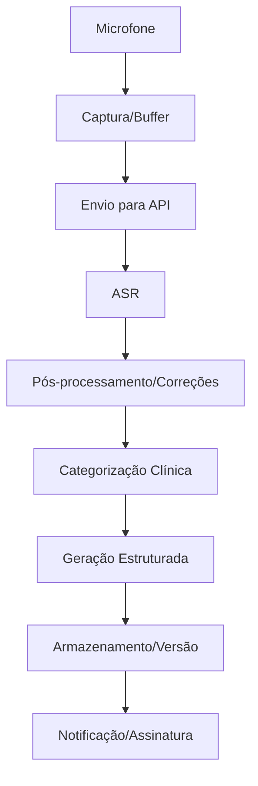
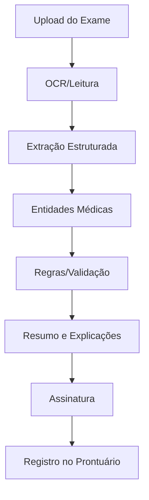
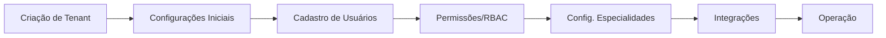
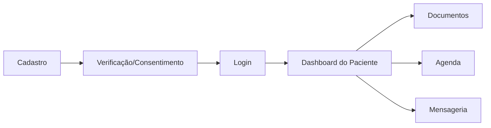

# Documentação da Plataforma MedPlatform (SaaS com IA)

## Sumário
- Visão Geral
- Arquitetura SaaS Multi‑tenant
- Funcionalidades Principais
- Dashboards por Especialidade
- Dashboard Administrativo
- Dashboard do Paciente
- Fluxos Operacionais (com fluxogramas)
- Modelagem de Dados (alto nível)
- Segurança, Privacidade e Conformidade
- Integrações (FHIR/HL7, PACS, Laboratórios)
- Observabilidade e Auditoria
- Performance e Escalabilidade
- Configuração e Personalização

---

## Visão Geral
- Plataforma SaaS multi‑tenant para gestão clínica com apoio de IA.
- Captura de áudio via microfone para transcrição automática, entendimento clínico e geração de prontuário, histórico e evolução.
- IA para resumir exames médicos (PDF, imagens, laudos) com extração de achados, interpretação e plano.
- Dashboards específicos por especialidade (Endocrinologia, Fisiatria, Ortopedia, etc.).
- Portais separados para Admin e Pacientes com experiências dedicadas.

## Arquitetura SaaS Multi‑tenant
- Multi‑tenant lógico: dados isolados por `tenant` com políticas de acesso.
- Camadas: Frontend Web, Backend API, Serviços de IA, Banco de Dados, Armazenamento de documentos e mídia.
- Serviços de IA desacoplados: ASR (fala‑para‑texto), NLU clínico, sumarização, extração de entidades médicas.
- Integrações via padrões de interoperabilidade (FHIR/HL7) e conectores para PACS/LIS.
- Filas e eventos para processamento assíncrono de áudio e documentos.

## Funcionalidades Principais
- Captura de áudio com microfone:
  - Gravação segura, envio em tempo real ou em lote, indicadores de nível.
  - Transcrição automática (ASR), diarização, correção ortográfica e normalização clínica.
- Assistente de IA para Prontuários, Histórico e Evolução:
  - Estruturação automática por seções (QP, HMA, Antecedentes, Exame Físico, Diagnósticos, Conduta).
  - Extração de sintomas, sinais, medicações, alergias, CID/ICD, SNOMED quando aplicável.
  - Geração de resumo, versão detalhada e checklist de dados faltantes.
  - Suporte a templates personalizáveis por especialidade.
- IA para Resumo de Exames Médicos:
  - Aceita PDF/imagens; executa OCR quando necessário.
  - Extrai medidas, achados, impressões e recomendações; produz resumo clínico e explicações.
  - Cria links com o prontuário e propõe evolução/conduta.
- Agendamento e Mensageria:
  - Agenda por profissional e sala; chat seguro com paciente.
- Gestão de Documentos:
  - Upload de laudos, imagens, relatórios; assinatura digital; controle de versão.
- Notificações:
  - E‑mail, SMS, push; lembretes de consulta, documentos prontos e tarefas.
- Acessibilidade e Internacionalização:
  - Suporte a leitores de tela, alto contraste, múltiplos idiomas.

## Dashboards por Especialidade
- Endocrinologia:
  - KPIs: TIR/tempo no alvo, HbA1c média, adesão terapêutica, metas individuais.
  - Widgets: curva glicêmica, histórico de medicações, eventos hipoglicêmicos, exames laboratoriais.
- Fisiatria:
  - KPIs: evolução funcional, escalas de dor, adesão ao plano de reabilitação.
  - Widgets: cronograma de terapias, exercícios prescritos, progresso por sessão.
- Ortopedia:
  - KPIs: tempo de recuperação, complicações, retorno à atividade.
  - Widgets: imagens e laudos, escala funcional, checklist pós‑operatório.
- Configuração de especialidade:
  - Seleção de métricas, widgets e templates de prontuário por tenant.

## Dashboard Administrativo
- Visão de organização:
  - Estatísticas de consultas, faturamento, cancelamentos, tempo médio de atendimento.
- Gestão de usuários e permissões:
  - Perfis (Admin, Médico, Assistente, Financeiro) com RBAC.
- Planos e Billing:
  - Assinaturas, limites de uso de IA (minutos de áudio, documentos/mês), cobrança.
- Compliance e Auditoria:
  - Trilhas de auditoria, consentimentos, relatórios de acesso.
- Integrações:
  - Conectores FHIR/HL7, PACS/LIS, exportações e importações.

## Dashboard do Paciente
- Acesso a documentos:
  - Prontuários, laudos, prescrições, recomendações; download e compartilhamento seguro.
- Agenda:
  - Visualização de próximas consultas, reagendamento, check‑in online.
- Interações:
  - Mensagens com a clínica, envio de documentos/exames, questionários pré‑consulta.
- Privacidade:
  - Controles de consentimento, histórico de acessos, solicitações de correção.

## Fluxos Operacionais

### Fluxo Macro de Atendimento com IA

```mermaid
flowchart LR
    Paciente((Paciente)) -->|Agendamento| Agenda[Agenda]
    Agenda --> Atendimento[Atendimento]
    Atendimento -->|Microfone| AudioCaptura[Captura de Áudio]
    AudioCaptura --> ASR[Transcrição ASR]
    ASR --> NLU[Entendimento Clínico]
    NLU --> Sumarizacao[Sumarização]
    Sumarizacao --> Prontuario[Prontuário/Evolução]
    Prontuario --> Assinatura[Assinatura/Validação]
    Assinatura --> Documentos[Emissão de Documentos]
    Documentos --> PortalPaciente[Portal do Paciente]
```

### Pipeline de Áudio e Geração de Prontuário

### Fluxo de Resumo de Exames

### Onboarding de Tenant e Administração

### Acesso do Paciente

## Modelagem de Dados (alto nível)
- Entidades principais:
  - Tenant, Usuário, Perfil, Permissão, Paciente, Profissional.
  - Consulta, Prontuário, Evolução, Documento, Exame, Template.
  - Agendamento, Mensagem, Consentimento.
  - Plano/Assinatura, Fatura, Uso de IA, Auditoria.
- Relacionamentos:
  - `Tenant` isola todas as entidades.
  - `Paciente` vincula `Consulta`, `Prontuário`, `Exame`, `Documento`.
  - `Usuário` vincula `Perfil` e `Permissão` por RBAC.

## Segurança, Privacidade e Conformidade
- LGPD/HIPAA:
  - Bases legais, mínimo necessário, consentimento explícito.
- Criptografia:
  - Em repouso (AES‑256), em trânsito (TLS 1.2+), chaves rotacionadas.
- Controles de acesso:
  - RBAC por função e escopo; logs e trilhas detalhadas.
- Isolamento de dados:
  - Políticas de linha/camada por `tenant`.
- Retenção e descarte:
  - Políticas configuráveis por tipo de documento.

## Integrações
- Padrões:
  - FHIR/HL7 para interoperabilidade; mapeamento de recursos clínicos.
- Sistemas externos:
  - PACS (imagens), LIS (laboratórios), faturamento, pagamentos.
- Importação/Exportação:
  - CSV/JSON/FHIR; jobs assíncronos com validação.

## Observabilidade e Auditoria
- Logs estruturados, métricas, traces distribuídos.
- Painéis de saúde do sistema, alertas e SLOs.
- Auditoria por entidade e usuário, relatórios periódicos.

## Performance e Escalabilidade
- Escala horizontal para serviços de IA e APIs.
- Cache para consultas frequentes, filas para tarefas pesadas.
- Limites de taxa por usuário/tenant; quotas de uso de IA.

## Configuração e Personalização
- Templates de prontuário por especialidade e equipe.
- Widgets e KPIs por dashboard configuráveis.
- Idioma, marca, domínio e políticas por tenant.

---

## Cenários de Uso
- Consulta presencial com ditado por microfone e geração imediata do prontuário.
- Upload de exame pelo paciente e resumo com explicações.
- Revisão administrativa de uso de IA e custos.

## Limitações e Roadmap
- Afinar modelos de IA por especialidade para maior precisão.
- Expansão de integrações (receituário eletrônico, e‑signature avançada).
- Mobile apps dedicados e suporte offline.

---

## Glossário
- ASR: Automatic Speech Recognition (fala‑para‑texto).
- NLU: Natural Language Understanding (entendimento de linguagem natural).
- FHIR/HL7: Padrões para interoperabilidade em saúde.
